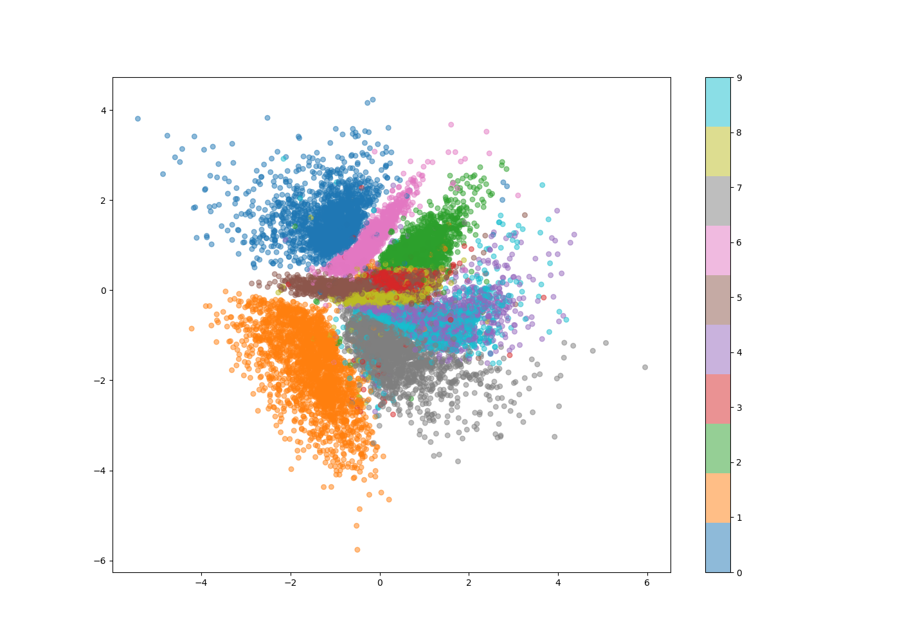
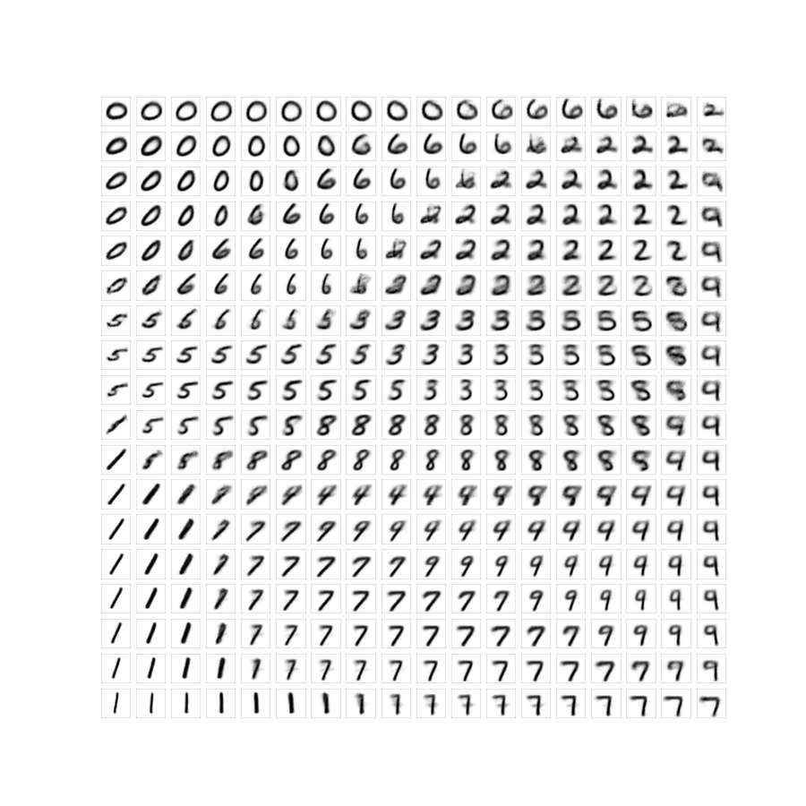

# VAE

A personnal implementation of Variational Auto Encoders.


## Installation

Run that line in a new environment to install the requirements:

```bash
pip install requirements -txt
```

The names of the files are explicit: 
- execute `train.py` to train the model
- execute `show.py` to show the results: the latent 2 dimensional space, or a grid showing reconstructed images

Latent dimension and loss weights can be changed in `build.py`
Number of epochs and batch size can be changed in `show.py`

Here is an example of results we get:

Here is a visualization of the latent space in 2 dimensions:




Here are some reconstructed images, corresponding to some chosen points on the previous figure:


